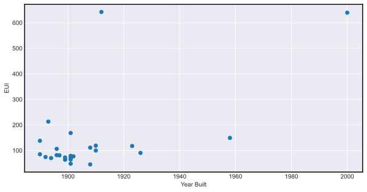
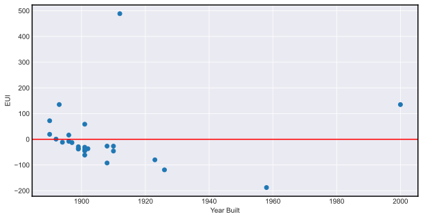

data4sustainability
==============================

Data science analysis for environmental sustainability. Rethinking baseline greenhouse gas emissions with data science.

# Project Organization

    ├── LICENSE
    ├── Makefile           <- Makefile with commands like `make data` or `make train`
    ├── README.md          <- The top-level README for developers using this project.
    ├── data
    │   ├── processed      <- The final, canonical data sets for modeling.
    │   └── raw            <- The original, immutable data dump.
    │
    ├── models             <- Trained and serialized models, model predictions, or model summaries
    │
    ├── notebooks          <- Jupyter notebooks. Naming convention is a number (for ordering),
    │                         the creator's initials, and a short `-` delimited description, e.g.
    │                         `1.0-jqp-initial-data-exploration`.
    │
    ├── references         <- Data dictionaries, manuals, and all other explanatory materials.
    │
    ├── reports            <- Generated analysis as HTML, PDF, LaTeX, etc.
    │   └── figures        <- Generated graphics and figures to be used in reporting
    │
    ├── requirements.txt   <- The requirements file for reproducing the analysis environment (pip), e.g.
    │                         generated with `pip freeze > requirements.txt`
    │
    ├── environment.yml   <- The requirements file for reproducing the analysis environment (conda).
    │
    ├── setup.py           <- makes project pip installable (pip install -e .) so src can be imported
    ├── src                <- Source code for use in this project.
    │   ├── __init__.py    <- Makes src a Python module
    │   │
    │   ├── models         <- Scripts to train models and then use trained models to make
    │   │   │                 predictions
    │   │   ├── predict_model.py
    │   │   └── train_model.py
    │   │
    │   └── visualization  <- Scripts to create exploratory and results oriented visualizations
    │       └── visualize.py

# Goal
Can you estimate the energy use intensity (EUI) of these new buildings if they were to have existed back in 2006 using historical data from buildings?

$$
\text{EUI} = \frac{\text{annual energy use (KBtu)}}{\text{building square footage (GSF)}}
$$

# Data Exploration

## Pearson Correlations of Features with Energy Use Intensity (EUI)

# Observations
* Location does not affect energy yse intensity (EUI)
* Year built and stories of a building are highly correlated with EUI
* EUI values range from 45 to 650

# Challenges
* Small dataset (125 values after preprocessing)
* Limited feature set
* Some of energy gas, and oil usages provided are 0 
  * Assume that data is invalid
* Extrapolating predictions to 2006

# Modeling and Strategies
* Simple Linear Regression
  * Benefits: fast and easy to interpret
  * Disadvantages: often unrealistic of real-world data with noise
* Support Vector Regression
  * Benefits: shown to be very successful in practice
  * Disadvantages: can be computationally intensive and must search for optimal hyperparameters
* K-Nearest Neighbors
  * Benefits: fast, easy to interpret, and no training process
  * Disadvantages: non-parametric algorithm (model grows with dataset size)

# Results
* Simple Linear Regression performs well predicting EUI with covariate, year built:

| Metric | Value |
| ------ | ----- |
| $R^2$  | 0.26  |
| MAE    | 41.34 |

## Residual Plot

 
* Support Vector Regression performs well in predicting energy use intensity (EUI):

| Metric | Value                            |
| ------ | -------------------------------- |
| $R^2$  | -0.31 (arbitrarily worse than 0) |
| MAE    | 49.91                            |

* K-Nearest Neighbors performs best in predicting energy use intensity (EUI):

| Metric | Value |
| ------ | ----- |
| $R^2$  | 0.44  |
| MAE    | 42.49 |
  

# Takeaways
* Promising performance for small subset of data and potentially erroneous samples
* With more data and features algorithms such as gradient boosting (XGBoost) and Neural Networks can be explored

